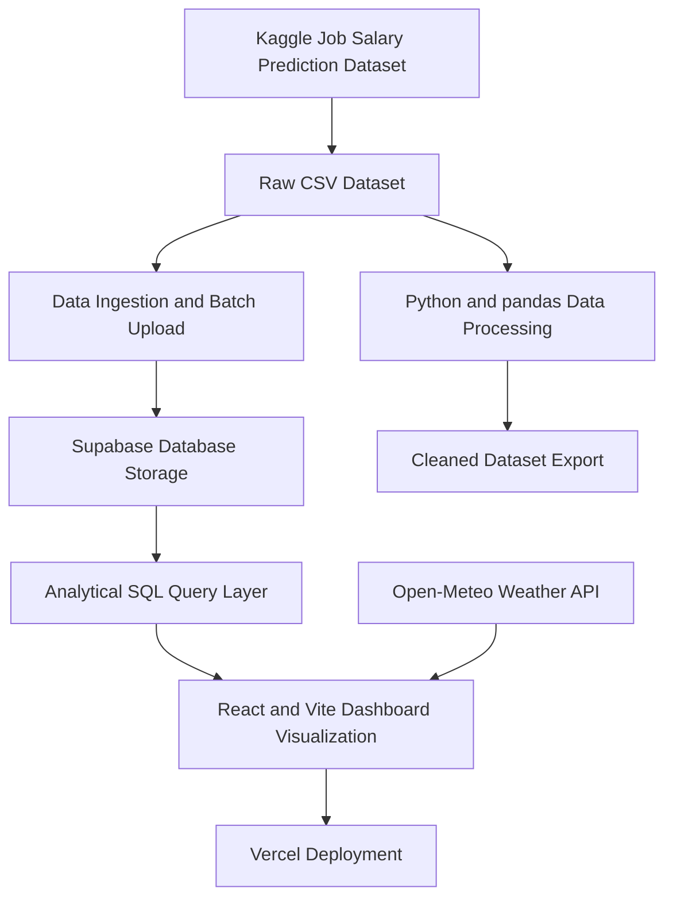

# Data Flow Architecture

This document explains how data moves through the Job Analytics dashboard from the original dataset source to the deployed web app.

## Actual Project Stack

- Dataset source: Kaggle Job Salary Prediction Dataset
- Raw data format: CSV file
- Raw file storage: GitHub repository, local project files, or Google Drive backup
- Database: Supabase
- Data loading: Python batch uploader
- Data cleaning: Python + pandas
- Analytical queries: SQL functions in Supabase
- Frontend: React + Vite
- Charts: Recharts
- Dashboard hosting: Vercel
- Extra API feature: Open-Meteo weather data in the topbar

Note: Some draft wording says Chart.js, but this codebase currently uses Recharts, not Chart.js.

## High-Level Flow

```text
Kaggle Dataset (CSV)
        |
        v
Raw Dataset Storage
        |
        v
Batch Upload Process
        |
        v
Supabase Database
        |
        v
Analytical Query Layer
        |
        v
React Dashboard
        |
        v
Vercel Deployment
```

## Full Architecture Diagram

```text
[ Kaggle Job Salary Prediction Dataset ]
                  |
                  v
[ Raw CSV Dataset ]
- downloaded source dataset
- contains job roles, experience, education, industry, remote work, and salary
- kept as the original source before processing
                  |
                  v
[ Data Ingestion ]
- reads the CSV rows
- prepares each row for database storage
- converts column names into database-friendly names
- converts numeric fields such as salary and years of experience
- uploads the dataset in batches instead of one row at a time
                  |
                  v
[ Supabase Database Storage ]
- stores the uploaded job salary records
- acts as the main database for the dashboard
- allows the frontend to request data using secure environment variables
                  |
                  v
[ Data Processing ]
- cleans missing or empty values
- fills missing numeric values with a median value
- fills missing text values with the most common value
- standardizes salary values for analysis
- removes extreme salary outliers using the IQR method
- exports a cleaned version of the dataset
                  |
                  v
[ Analytical Query Layer ]
- calculates dashboard summary statistics
- calculates average salary
- finds the highest salary
- counts total dataset records
- calculates average years of experience
- groups salary by experience level
- compares salary by remote, hybrid, and on-site work types
- finds the top highest-paying job roles
- provides job title options for dashboard filtering
                  |
                  v
[ Dashboard Visualization ]
- displays KPI cards for important metrics
- displays salary charts
- displays work type comparison charts
- displays top-paying job charts
- provides job title filters
- provides a paginated dataset table
- displays written insights based on the analysis
- displays current weather in the topbar
                  |
                  v
[ Vercel Deployment ]
- hosts the live dashboard
- serves the React + Vite frontend
- uses production environment variables to connect to Supabase
```

## Mermaid Diagram

Use this version if your report supports Mermaid diagrams.



## Five Required Blocks

### 1. Data Ingestion

The project starts with the Kaggle Job Salary Prediction Dataset. The dataset is downloaded as a CSV file.

During ingestion, the system:

- Reads the raw CSV data
- Converts column names into a database-friendly format
- Converts important fields into numbers, such as salary and experience years
- Groups rows into batches
- Uploads the records to Supabase

This avoids uploading the dataset one row at a time, which would be slow for a large dataset.

### 2. Data Storage

The raw dataset is stored as a CSV file. It can be kept in the project repository, backed up in GitHub, or stored externally in Google Drive.

The uploaded dataset is stored in Supabase. Supabase is the main database used by the dashboard.

The deployed frontend connects to Supabase using public frontend environment variables. The service role key is not used in the deployed browser app.

### 3. Data Processing

The project uses Python and pandas to clean and process the dataset.

The processing stage:

- Detects missing values
- Fills missing numeric values with the median
- Fills missing text values with the most common value
- Adds indicators showing which values were originally missing
- Standardizes salary values
- Removes salary outliers using the IQR method
- Exports a cleaned dataset

This makes the data more consistent before analysis.

### 4. Data Query Pipeline

After the data is stored in Supabase, SQL queries prepare the numbers needed by the dashboard.

The query layer calculates:

- Average salary
- Highest salary
- Total number of records
- Average years of experience
- Average salary by experience level
- Average salary by work setup
- Top highest-paying job roles
- Available job title filters

The frontend does not calculate all analytics manually. It asks Supabase for prepared analytical results.

### 5. Data Visualization

The frontend is built with React and Vite.

The dashboard displays:

- KPI cards for summary metrics
- Salary by experience chart
- Salary by work type chart
- Top paying jobs chart
- Insights cards
- Job title filtering
- Paginated data table
- Current weather in the topbar

The dashboard is deployed on Vercel so users can access the live web app through a public URL.

## Short Report Version

You can paste this into a report:

```text
The system begins with the Kaggle Job Salary Prediction Dataset, which is downloaded as a CSV file. The raw dataset is stored in the project and can also be backed up using GitHub or Google Drive. During ingestion, a Python process reads the CSV, prepares each row, converts important fields into the correct format, and uploads the records to Supabase in batches.

The dataset is then processed using Python and pandas. The processing step handles missing values, standardizes salary data, removes salary outliers, and exports a cleaned dataset. After the data is stored in Supabase, SQL queries calculate the analytical results needed by the dashboard, such as average salary, salary by experience, salary by work type, top paying jobs, and job title filter options.

The React and Vite frontend reads the prepared results from Supabase and displays them as KPI cards, charts, filters, insights, and a paginated data table. The dashboard is deployed on Vercel, while environment variables are used to connect the live app to Supabase securely.
```

## Diagram Text For The Report

```text
[ Kaggle Job Salary Prediction Dataset ]
                  |
                  v
[ Raw CSV Dataset ]
- original downloaded dataset
                  |
                  v
[ Data Ingestion ]
- reads CSV rows
- prepares database records
- uploads records in batches
                  |
                  v
[ Supabase Database ]
- stores job salary records
                  |
                  v
[ Data Processing ]
- handles missing values
- standardizes salary
- removes outliers
- exports cleaned data
                  |
                  v
[ Analytical Query Layer ]
- calculates KPI values
- groups salary by experience
- compares work setup salaries
- finds top-paying job roles
- provides filter options
                  |
                  v
[ Dashboard Visualization ]
- KPI cards
- charts
- filters
- data table
- insights
                  |
                  v
[ Vercel Deployment ]
- hosts the live dashboard
```
